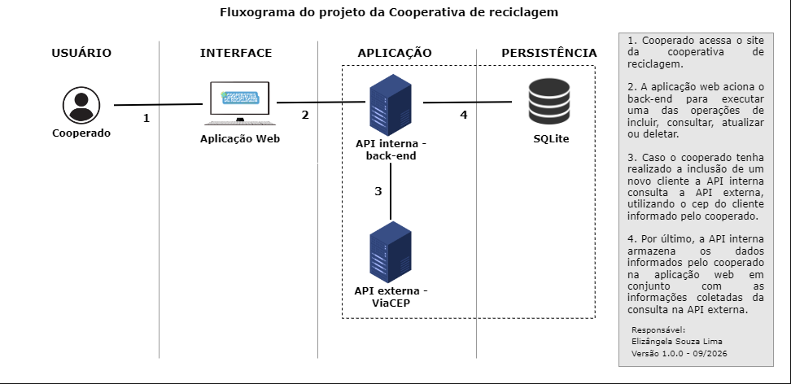

# Projeto Cooperativa de Reciclagem

>Este projeto é o módulo Interface do MVP da Sprint: Desenvolvimento Back-end Avançado, que visou atender a necessidade de armazenamento e consulta das informações de uma cooperativa de reciclagem.

Para isso, foi desenvolvido:
- Aba inicial com gráfico de estoque e de vendas com card de orientações de uso da aplicação para os usuários;
- Formulário para a inclusão de registros de cooperado, de cliente, de triagem e de venda;
- Formulário de edição de registros de cooperados e de clientes;
- Tabelas de consulta das informações de Cooperado, de Cliente, de Registro de Triagem e de Registros de Venda.

## Funcionalidades

- Inclusão, atualização, consulta e exclusão de registros.

## Tecnologias utilizadas

As principais ferramentas utlizadas foram:

- React

## Fontes, icones e imagens utilizadas
- Fontes: [Google Fonts](https://fonts.google.com/)
- Imagem "logo.png": Desenvolvida com a ferramenta [Canva](https://www.canva.com/)
- Imagem "cooperados.jpg": [Freepik](https://br.freepik.com/vetores-gratis/pessoas-felizes-reciclando_16409640.htm#fromView=keyword&page=4&position=19&uuid=a8574400-6f60-40d3-b699-de7a294e3dc9&query=Cooperativa+reciclagem)
- Gif "loading_gif.gif": [Pixabay](https://pixabay.com/pt/gifs/fiandeira-flor-carregando-carga-8565/)

## Como executar com Dockerfile

### 1. Utilizar o comando no terminal `docker build -t interface .`
Para construir a imagem.

### 2. Utilizar o comando no terminal `docker run -p 3000:80 interface`
Para rodar o container.

### 3. Acessar o link  no navegador

### 4. Executar a aplicação back-end 
Clone o [repositório da API Back-end](https://github.com/elizangela-souza/MVPback-end.git) e siga as orientações no arquivo README.md para execução.

## Como executar sem Dockerfile

### 1. Utilizar o comando no terminal `npm install`
Para instalar as dependências utilizadas na aplicação.

### 2. Utilizar o comando no terminal `npm start`
Para executar o aplicativo em modo de desenvolvimento.
Abra http://localhost:3000 para visualizar no seu navegador.

A página será recarregada automaticamente quando você fizer alterações.
Você também poderá ver quaisquer erros de lint no console.

### 3. Executar a aplicação back-end 
Clone o [repositório da API Back-end](https://github.com/elizangela-souza/MVPback-end.git) e siga as orientações no arquivo README.md para execução.

## Fluxograma
